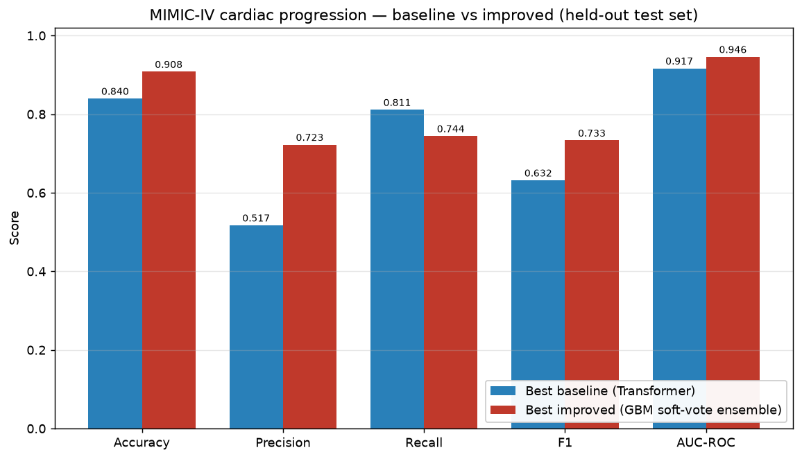
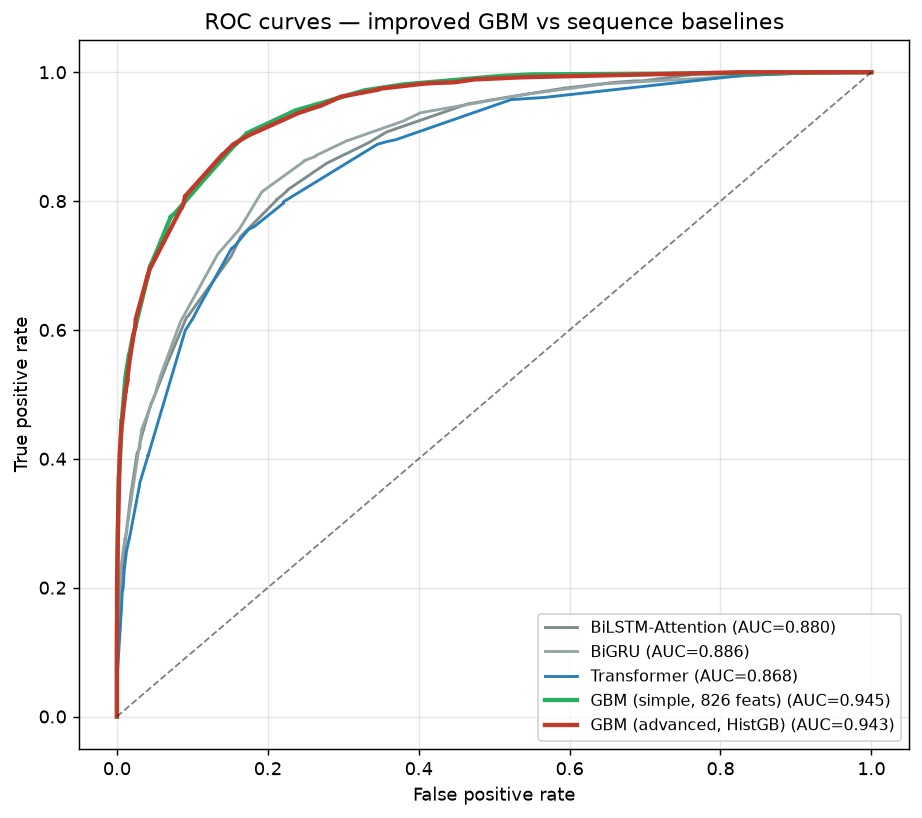
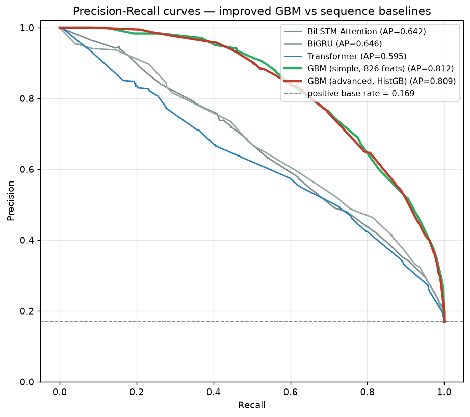
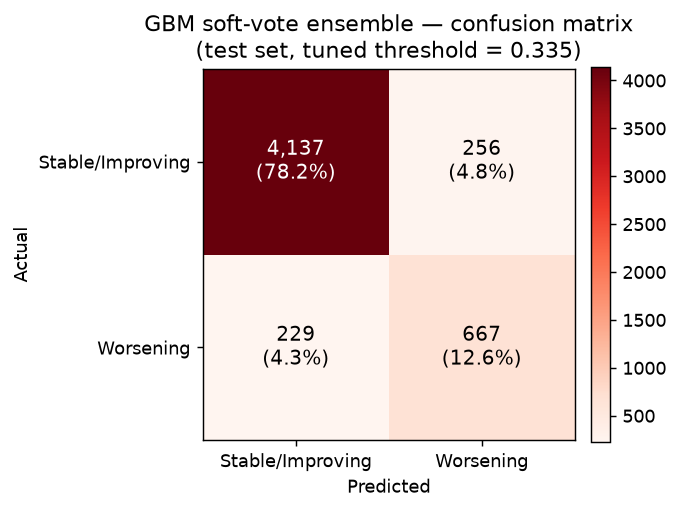
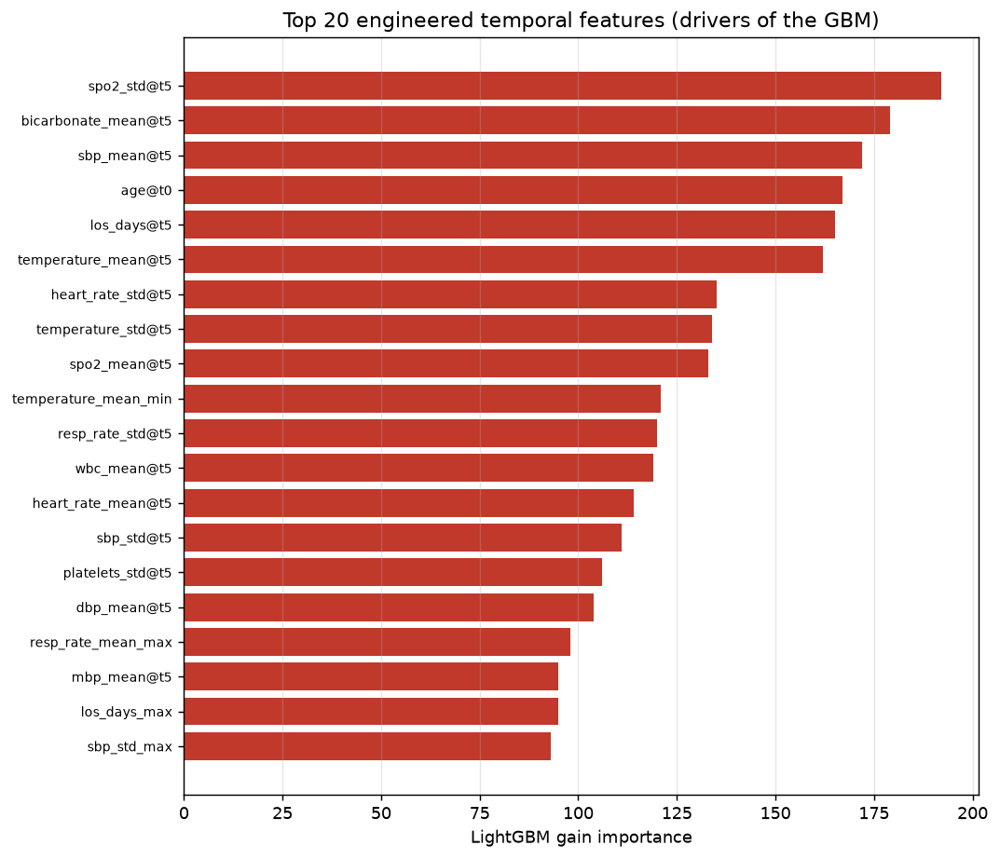
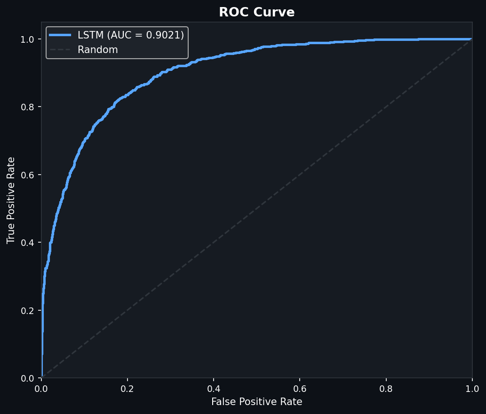
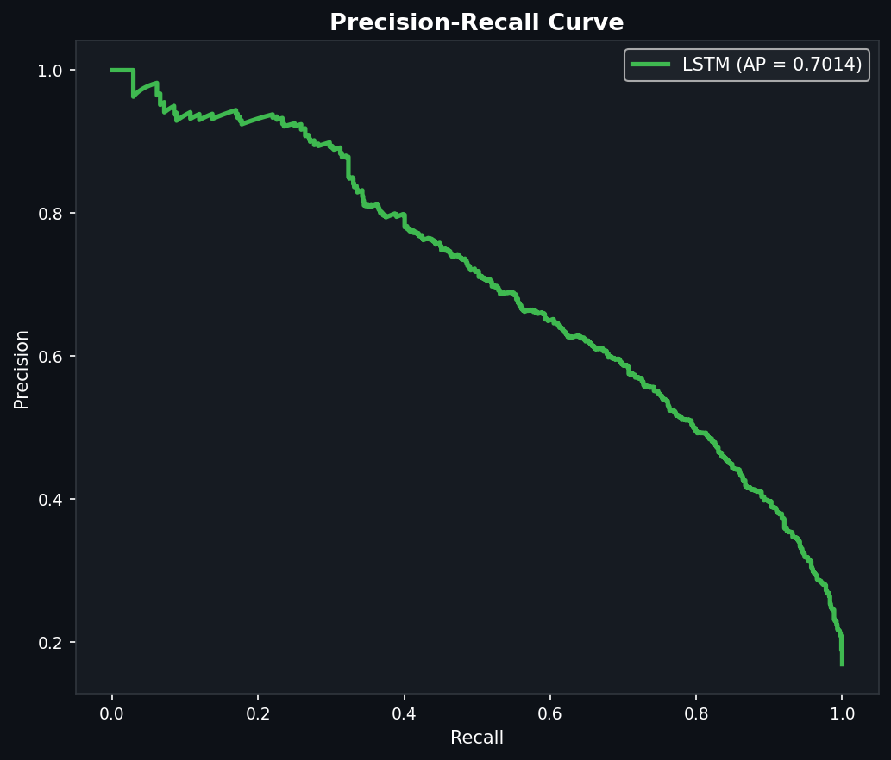
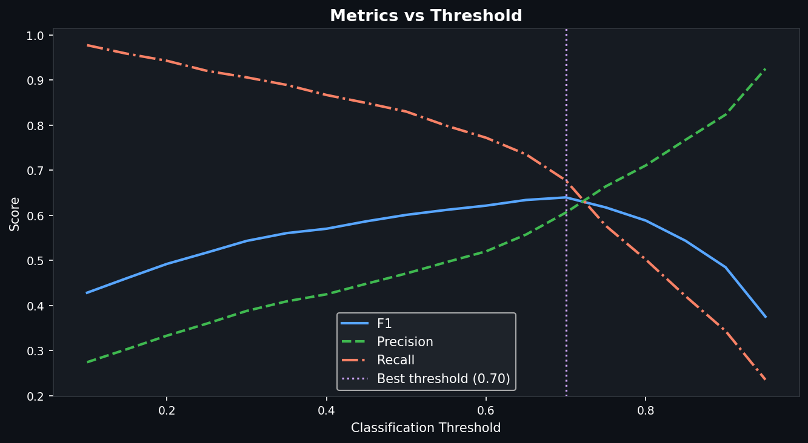

# Heart Disease Temporal Analysis

Longitudinal deep-learning pipeline for predicting cardiac condition progression
from ICU admissions in MIMIC-IV. The project builds patient visit sequences and
trains sequence models for binary classification:

- `1`: worsening cardiac progression
- `0`: stable or improving progression

## Quick Start: CardioPulse AI Full-Stack Application

The repository includes a modern clinical intelligence web application powered by a **FastAPI backend** and an interactive **temporal trajectory dashboard frontend**:

```bash
python run_app.py
# or:
py -3.14 run_app.py
```

- **Clinical Frontend Dashboard**: `http://127.0.0.1:8000`
- **Interactive REST API Docs (Swagger UI)**: `http://127.0.0.1:8000/docs`

Key capabilities:
- **Patient Trajectory Predictor**: Load pre-built clinical scenarios or adjust parameters across any of the 6 ICU visits with live interactive charts and risk gauge.
- **Batch CSV Analysis**: Upload multi-patient trajectory CSV files or download pre-formatted sample files to score cohorts.
- **Model Benchmarks**: Interactive comparative metrics table and high-resolution ROC/PR/Confusion Matrix plots across all 8 evaluated models.
- **59-Feature Clinical Reference Dictionary**: Searchable reference of all MIMIC-IV features with physiological categories, standard units, and clinical notes.

You can also run automated backend tests anytime:
```bash
py -3.14 -m unittest backend/test_api.py
```

## Key Project Information Below

| Item | Value |
|---|---|
| Dataset | MIMIC-IV 2.1 cardiac progression cohort |
| Raw data path | `data/mimic_iv_raw/mimic-iv-2-1.zip` |
| Task | Binary classification of worsening vs stable/improving cardiac progression |
| Sequence length | 6 ICU stays/admissions |
| Feature count | 59 features per timestep |
| Train split | 24,678 samples, 4,178 positives |
| Validation split | 5,289 samples, 896 positives |
| Test split | 5,289 samples, 896 positives |
| Positive class rate | About 16.9% |
| Best overall model | Transformer Encoder Classifier |
| Best recall model | BiGRU |

The full result details are stored in:

```text
docs/model_results.md
results.json
```

## Final MIMIC-IV Results

The latest full Google Colab GPU run trained all three models on the full
MIMIC-IV cardiac progression dataset. The held-out test set had 5,289 samples:
896 worsening cases and 4,393 stable/improving cases.

| Model | Accuracy | Precision | Recall | F1 Score | AUC-ROC |
|---|---:|---:|---:|---:|---:|
| BiLSTM Attention | 0.8134 | 0.4712 | 0.8304 | 0.6012 | 0.9021 |
| BiGRU | 0.8132 | 0.4712 | 0.8404 | 0.6038 | 0.9076 |
| Transformer Encoder Classifier | 0.8198 | 0.4814 | 0.8237 | 0.6077 | 0.9096 |

Best AUC-ROC and F1 score came from the **Transformer Encoder Classifier**.
Best recall came from **BiGRU**, which caught the largest fraction of worsening
cases.

Precision is lower than recall because the dataset is imbalanced: only about
16.9% of samples are worsening cases. With weighted loss, the models are
encouraged to detect the minority worsening class, so they identify many true
worsening cases but also produce more false positives. This improves recall and
AUC-ROC, but it reduces precision at the default `0.5` threshold.

## Improved Results (Aug 2026)

After reproducing the baseline on freshly rebuilt arrays (same 70/15/15
stratified split, `random_state=42`), we explored better training recipes and a
new model family. **The headline: a gradient-boosted-tree ensemble on
engineered temporal features beats every sequence model by a wide margin while
being far cheaper to train and deploy.**

### Fair baseline (retrained on the exact same arrays)

The numbers published above came from a seed-free Colab run. To compare fairly,
we retrained the three sequence models on the *identical* arrays used for every
improved model. This reproduction is slightly stronger than the published run,
so it is the honest bar to beat (all @ threshold `0.5`):

| Model | Accuracy | Precision | Recall | F1 | AUC-ROC |
|---|---:|---:|---:|---:|---:|
| BiLSTM Attention | 0.8308 | 0.5003 | 0.8103 | 0.6187 | 0.9060 |
| BiGRU | 0.8211 | 0.4837 | 0.8259 | 0.6101 | 0.9099 |
| Transformer Encoder | 0.8399 | 0.5174 | 0.8114 | 0.6319 | 0.9168 |

### Improved models (test set, calibrated + F1-tuned threshold)

| Model / method | Accuracy | Precision | Recall | **F1** | **AUC-ROC** | PR-AUC |
|---|---:|---:|---:|---:|---:|---:|
| **GBM soft-vote ensemble** ⭐ | 0.9083 | 0.7226 | 0.7444 | **0.7334** | **0.9462** | 0.8302 |
| GBM stacked ensemble | 0.9125 | 0.7612 | 0.7042 | 0.7316 | 0.9462 | 0.8307 |
| GBM (HistGB, rich features) | 0.9126 | 0.7747 | 0.6830 | 0.7260 | 0.9434 | 0.8093 |
| GBM (LightGBM) | 0.9079 | 0.7332 | 0.7176 | 0.7253 | 0.9439 | 0.8153 |
| GBM (XGBoost) | 0.9032 | 0.6983 | 0.7545 | 0.7253 | 0.9433 | 0.8069 |
| GBM (simple, 826 features) | 0.9102 | 0.7451 | 0.7143 | 0.7293 | 0.9450 | 0.8115 |

⭐ **Best model: the GBM soft-vote ensemble** (HistGB + LightGBM + XGBoost,
isotonic-calibrated, threshold tuned on validation).

### Baseline → improved (best of each)

| Metric | Best baseline (reproduced) | **Best improved** | Gain |
|---|---:|---:|---:|
| F1 | 0.6319 (Transformer) | **0.7334** | **+0.1015 (+16%)** |
| AUC-ROC | 0.9168 (Transformer) | **0.9462** | **+0.0294** |
| Accuracy | 0.8399 (Transformer) | **0.9126** | **+0.0727** |
| Precision | 0.5174 (Transformer) | **0.7747** | **+0.2573** |

The improved model does not just trade recall for precision — it lifts
precision from ~0.52 to ~0.72–0.77 **while holding recall around 0.74**, ending
the baseline's precision/recall imbalance.

### Why gradient boosting wins here

The raw sequence is only 6 timesteps × 59 features. The strongest signal is not
long-range temporal structure but *how each variable is changing* — its trend,
volatility and recent velocity. We make that explicit with engineered temporal
descriptors per feature (last / first / mean / std / min / max / median / IQR /
range / delta / slope / half-split trend / velocity / acceleration / total
variation / coefficient of variation / position-in-range), then let gradient
boosting model their interactions. The most important features are clinically
sensible: **SpO₂ variability, blood-pressure and heart-rate variability, and
WBC**.

### What this buys for real-world deployment

| Property | Sequence baselines | **GBM (deployable)** |
|---|---|---|
| Best F1 / AUC | 0.632 / 0.917 | **0.726–0.733 / 0.946** |
| Train time (CPU) | ~5–10 min each | **~15 s (simple) – a few min** |
| Inference | PyTorch runtime | **milliseconds, pure sklearn/LightGBM** |
| Artifact size | ~2–3 MB `.pth` + framework | **3.3 MB self-contained `.joblib`** |
| Interpretability | attention weights | **native feature importances** |
| GPU required | helpful | **no** |

The single best deployable artifact is `models/deployable/gbm_advanced.joblib`
(the HistGB model + calibrator + tuned threshold + feature builder, 3.3 MB).

### Reproduce

```bash
# 1) Fair baseline on the current arrays
python src/model_training/train_bilstm_attention.py --epochs 80 --lr 0.0003 --batch_size 128 --patience 12
python src/model_training/train_bigru.py            --epochs 80 --lr 0.0003 --batch_size 128 --patience 12
python src/model_training/train_transformer_encoder.py --epochs 80 --lr 0.0003 --batch_size 128 --patience 12

# 2) Deployable gradient-boosting model (fast, sklearn-only)
python src/model_training/train_deployable_gbm.py

# 3) Full GBM family + ensembles (HistGB + LightGBM + XGBoost)
python src/model_training/train_gbm_advanced.py

# 4) Production deep model (TFT-style), device-agnostic; see colab/ for GPU
python src/model_training/train_gtan.py --seeds 5 --epochs 120 --loss focal
```

> Deep-learning tracks (improved-recipe sequence models via `train_improved.py`
> and the Gated Temporal Attention Network via `train_gtan.py` / the Colab GPU
> notebook in `colab/`) are in progress; their final numbers will be added here
> once those runs complete.

### Result visualizations

Regenerate any time with
`python src/reporting/visualize_improved_results.py` (reads the saved
predictions and metrics — no raw data needed).

**Baseline vs improved across every metric.** Precision jumps from ~0.52 to
~0.72 and F1 from 0.63 to 0.73 while recall stays around 0.74 — the improved
model fixes the imbalance instead of trading one metric for another.



**ROC and precision-recall curves.** The gradient-boosting models (green/red)
sit clearly above every sequence baseline (grey/blue) across the whole curve.




**Confusion matrix — best model.** GBM soft-vote ensemble on the 5,289-sample
test set at the validation-tuned threshold (0.335).



**What drives the model.** The most important engineered temporal features are
clinically sensible: SpO₂ variability, bicarbonate, blood-pressure and
heart-rate levels/variability, age, length of stay, temperature and WBC.



## Result Curves

The following plots are from the trained LSTM/BiLSTM attention model. They show
that the model learns useful separation between worsening and stable/improving
cases.



The ROC curve has AUC `0.9021`, which is strong discrimination for the held-out
MIMIC-IV test set.



The precision-recall curve has average precision `0.7014`. This is much higher
than the positive-class base rate of about `0.169`, so the model is performing
well on the minority worsening class.



The threshold sweep shows why threshold tuning matters. The default `0.5`
threshold favors recall, while a threshold around `0.70` gives a better
precision-recall balance and the best F1 score for this model.

## Models Used

### BiLSTM Attention

`src/model_training/train_bilstm_attention.py` trains a 2-layer bidirectional
LSTM with an attention pooling head. It models the sequence in both temporal
directions and learns which visits matter most for prediction.

### BiGRU

`src/model_training/train_bigru.py` trains a 2-layer bidirectional GRU model.
It is a recurrent baseline with fewer parameters than the LSTM and achieved the
highest recall in the current run.

### Transformer Encoder Classifier

`src/model_training/train_transformer_encoder.py` trains an encoder-only
Transformer classifier. It is not a decoder-only Transformer and not a language
model. It uses:

- A projection from 59 clinical features to `d_model=128`
- A learnable CLS classification token
- Sinusoidal positional encoding
- 8-head self-attention
- 3 Transformer encoder layers
- A feed-forward classification head

This model achieved the best AUC-ROC and F1 score in the current MIMIC-IV run.

## Model Inputs

Each sample has shape:

```text
(sequence_length, 59_features)
```

Default sequence length is `6` ICU stays. Patients with fewer stays are padded
from their earliest available stay.

Feature groups include:

- Vital signs: heart rate, blood pressure, respiratory rate, temperature, SpO2
- Cardiac markers: troponin, BNP, NT-proBNP
- Metabolic and renal labs: creatinine, BUN, glucose
- Electrolytes: potassium, sodium, chloride, bicarbonate
- CBC: hematocrit, hemoglobin, WBC, platelets
- Clinical context: age, length of stay, prior cardiac conditions, ICU/admission flags
- Temporal context: days since prior admission, time delta, visit index

Each model outputs a sigmoid probability of worsening progression. The default
classification threshold is `0.5`; compare AUC-ROC, F1, recall, and precision
before choosing the final operating threshold.

## Next Improvements

Done in the Aug 2026 improved run (see **Improved Results** above):

- ✅ Threshold tuned on validation for max F1 instead of a fixed `0.5`.
- ✅ Focal loss and milder class weighting added (`train_improved.py`,
  `train_gtan.py`).
- ✅ Isotonic probability calibration on validation.
- ✅ Rich temporal features (slopes, deltas, velocity, acceleration, total
  variation, trend) driving the winning gradient-boosting model.
- ✅ Hyperparameter search across HistGB / LightGBM / XGBoost, selected on
  validation PR-AUC.

Still planned:

- Finish the deep-learning tracks (improved-recipe sequence models and the
  Gated Temporal Attention Network) and add their final numbers.
- Add missingness indicators as explicit features.
- Compare performance across clinically meaningful subgroups and tune for the
  preferred clinical tradeoff between recall and precision.

## Quick Colab Workflow

Use this notebook for the full raw MIMIC-IV rebuild:

```text
notebooks/mimiciv_colab_gpu_training.ipynb
```

Use this notebook when you already have the extracted feature ZIP and only want
to train models:

```text
notebooks/mimiciv_colab_train_from_extracted_features.ipynb
```

Recommended Colab flow:

1. Upload this project folder to Google Drive.
2. Put `mimic-iv-2-1.zip` in `data/mimic_iv_raw/`.
3. Open the notebook in Colab.
4. Runtime -> Change runtime type -> GPU.
5. Run the notebook top to bottom.

Full Colab command:

```bash
python src/run_full_colab_training.py --zip data/mimic_iv_raw/mimic-iv-2-1.zip --chunk 100000 --seq_len 6 --epochs 80 --lr 0.0003 --batch_size 128 --hidden_size 128 --patience 12
```

For future runs, prefer
`notebooks/mimiciv_colab_train_from_extracted_features.ipynb` after uploading
`mimiciv_extracted_features_seq6.zip`. This skips the raw 10GB preprocessing
step and trains directly from `data/preprocessed/*.npy`.

## Reuse Extracted Features

After preprocessing once, package the extracted features so future Colab runs do
not need to rebuild from the raw MIMIC-IV ZIP.

Run this in Colab after preprocessing is complete:

```python
from pathlib import Path
import shutil
import zipfile

PROJECT_DIR = Path("/content/drive/MyDrive/Temporal Analysis")
feature_zip = PROJECT_DIR / "mimiciv_extracted_features_seq6.zip"

if feature_zip.exists():
    feature_zip.unlink()

shutil.make_archive(
    base_name=str(feature_zip.with_suffix("")),
    format="zip",
    root_dir=PROJECT_DIR,
    base_dir="data/preprocessed",
)

csv_path = PROJECT_DIR / "data/real/mimiciv_longitudinal_features.csv"
with zipfile.ZipFile(feature_zip, "a", compression=zipfile.ZIP_DEFLATED) as zf:
    if csv_path.exists():
        zf.write(csv_path, arcname="data/real/mimiciv_longitudinal_features.csv")

print("Created:", feature_zip)
```

Download the feature package from Colab:

```python
from google.colab import files

files.download("/content/drive/MyDrive/Temporal Analysis/mimiciv_extracted_features_seq6.zip")
```

Next time, upload and restore the feature package:

```python
from google.colab import files
from pathlib import Path
import zipfile

PROJECT_DIR = Path("/content/drive/MyDrive/Temporal Analysis")

uploaded = files.upload()
zip_name = next(iter(uploaded))

with zipfile.ZipFile(zip_name, "r") as zf:
    zf.extractall(PROJECT_DIR)

print("Restored extracted features to:", PROJECT_DIR)
print("Ready to train using data/preprocessed/*.npy")
```

Then train directly without the raw 10GB preprocessing step:

```bash
python src/model_training/train_bilstm_attention.py --epochs 80 --lr 0.0003 --batch_size 128 --hidden_size 128 --patience 12
python src/model_training/train_bigru.py --epochs 80 --lr 0.0003 --batch_size 128 --hidden_size 128 --patience 12
python src/model_training/train_transformer_encoder.py --epochs 80 --lr 0.0003 --batch_size 128 --patience 12
```

If using the older Colab layout, use:

```bash
python src/models/train_lstm.py --epochs 80 --lr 0.0003 --batch_size 128 --hidden_size 128 --patience 12
python src/models/train_gru.py --epochs 80 --lr 0.0003 --batch_size 128 --hidden_size 128 --patience 12
python src/models/train_transformer.py --epochs 80 --lr 0.0003 --batch_size 128 --patience 12
```

## Local Setup

```bash
python -m venv .venv
.venv\Scripts\activate
pip install -r requirements.txt
```

## Build Real Dataset

Use this when you want to rebuild arrays from the full downloaded MIMIC-IV ZIP:

```bash
python src/preprocessing/build_cardiac_progression_dataset.py --zip data/mimic_iv_raw/mimic-iv-2-1.zip --chunk 100000 --seq_len 6
```

Lower `--chunk` to `25000` or `50000` if RAM is limited. The script streams the
large CSVs from the ZIP and saves:

```text
data/preprocessed/X_train.npy
data/preprocessed/X_val.npy
data/preprocessed/X_test.npy
data/preprocessed/y_train.npy
data/preprocessed/y_val.npy
data/preprocessed/y_test.npy
data/preprocessed/preprocessor.pkl
data/preprocessed/feature_names.pkl
```

## Train Models Locally

```bash
python src/model_training/train_bilstm_attention.py --epochs 80 --lr 0.0003 --batch_size 64 --patience 12
python src/model_training/train_bigru.py --epochs 80 --lr 0.0003 --batch_size 64 --patience 12
python src/model_training/train_transformer_encoder.py --epochs 80 --lr 0.0003 --batch_size 64 --patience 12
python evaluate_trained_models.py
python src/reporting/evaluate_and_visualize_all_models.py
```

## Project Structure

```text
Temporal Analysis/
|-- README.md
|-- requirements.txt
|-- evaluate_trained_models.py
|-- results.json
|-- docs/
|   |-- project_architecture.md
|   |-- dataset.md
|   |-- model_results.md
|   |-- assets/
|   |   `-- results/
|   `-- models/
|       |-- bilstm_attention.md
|       |-- bigru.md
|       `-- transformer_encoder.md
|-- data/
|   |-- mimic_iv_raw/          # MIMIC-IV ZIP, not committed
|   `-- preprocessed/          # .npy arrays and scaler, not committed
|-- notebooks/
|   `-- mimiciv_colab_gpu_training.ipynb
|-- src/
|   |-- run_full_colab_training.py
|   |-- run_full_local_pipeline.py
|   |-- preprocessing/
|   |-- model_training/
|   `-- reporting/
```

## Troubleshooting

If training prints `Train Loss: nan` from the first epoch, stop the run. That
usually means the saved `X_*.npy` arrays contain `NaN` or infinite values, and
the apparent 83 percent accuracy is just the majority stable/improving class.
The preprocessing script now sanitizes arrays before saving, and every trainer
validates the arrays before training.

If visualization fails with a PyTorch `weights_only` loading error, load trusted
project checkpoints with:

```python
torch.load(model_path, map_location=device, weights_only=False)
```
